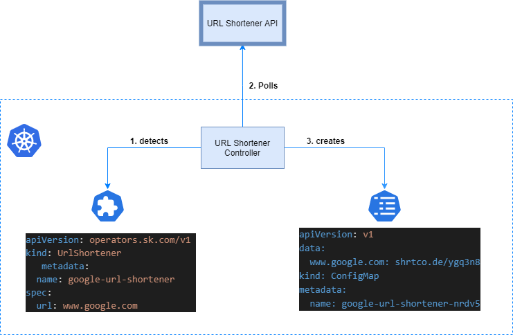

# k8s-operators


## Getting started with k8s operators

[Kubernets Operators](https://kubernetes.io/docs/concepts/extend-kubernetes/operator/) are software extensions to Kubernetes that make use of [custom resources](https://kubernetes.io/docs/concepts/extend-kubernetes/api-extension/custom-resources/) to manage applications and their components. Operators follow Kubernetes principles, notably the [control loop](https://kubernetes.io/docs/concepts/architecture/controller)
## Local Setup

### Prerequisite
  - K8s running locally
  - Python 3.6 or higher version available
  - [Kopf](https://kopf.readthedocs.io/en/stable/concepts/) - is a framework to build Kubernetes operators in Python.

### Kopf Installation

```
pip install kopf
pip install kubernetes
```

## Demo

### Use case
   We will build a python operator which will accept an input as a URL and shorten it and store it into a config map

## Steps

1.  Creating the CRD
    - Creating a CRD is nothing else than registering a new Kubernetes resource type with a fixed set of fields and their data types.
    - To accomplish this we’ll use the kubernetes manifest


  ```
      cat -n url-shortener-crd.yml
      kubectl apply -f url-shortener-crd.yml
  ```
      

2. Implementing a controller

      - A controller can be built using Go or Python. Here we will use python.
      - The controller application itself is essentially an endless loop that constantly watches Kubernetes resources of a specific kind (similar to a deployment, statefulset etc), in our case UrlShortener objects. Upon an update (creation, modification, deletion) its business logic will react accordingly.
      - Although this could be implemented from scratch there’s a great framework that does most of the heavy lifting called [Kopf](https://kopf.readthedocs.io/en/stable/concepts/). It allows you to almost entirely focus on implementing the business logic of your controller.


      
  ```
      kopf run url-shortener-operator.py
  ```

    
  
  

3. Optionally as an operator will, similar to any other application, run within a Pod, we can package it as one of the Kubernetes supported image formats. A Dockerfile can be built wrapping the controller inside and same can be run as a k8s deployment with replicas = 1


## Test and Deploy

We will create UrlShortener object

  ```
    kubectl apply -f url-shortener.yml
  ```

- Our controller will pick this new UrlShortener object creation request and will create/ update the config map with the short url of the original url defined in the `url-shortener` object
- Describe the configmap


```
kubectl describe configmaps google-url-shortener-nrdv5

```

***

#

